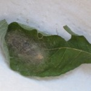
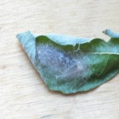
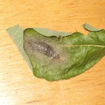
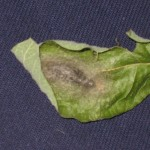
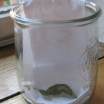

Bilder von der Puppe
####################
:date: 2008-07-29 10:53
:author: Lioman
:category: Allgemein
:tags: Bilder, Gammeule, Raupe, Schmetterling, Zucht
:slug: bilder-puppe
:status: published

Hier sind Bilder von der Puppe, die letzten sind im Schlupfglas gemacht.

Dort liegt die Puppe sicher und weich und über die Papierbahn kann dann
der frisch geschlüpfte Falter nach oben krabbeln.

Ich muss aber das Glas wahrscheinlich verschließen, sonst müsste ich
erstmal auf die Jagd gehen.

|Puppe01|\ |Puppe06|\ |Puppe07|\ |Puppe08|\ |schlupfglas1|\ |Schlupfglas2|

**Nachtrag**: Dies war die Puppe einer Messingeule, dass hat sich erst
nach dem Schlüpfen gezeigt.

Siehe `hier <http://www.lioman.de/2008/08/es-ist-eine-messingeule/>`__

.. |schlupfglas1| image:: images/schlupfglas1-150x150.jpg
   :class: alignleft size-thumbnail wp-image-1006
   :width: 150px
   :height: 150px
   :target: images/schlupfglas1.jpg

