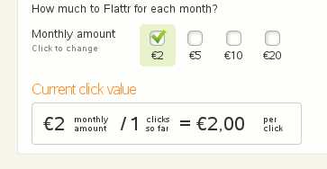

Endlich Flattr
##############
:date: 2010-05-11 13:30
:author: Lioman
:category: Internet
:tags: Blog, Flattr, Geld, Micropayment, Plugin, verdienen, Wordpress
:slug: endlich-flattr
:status: published

***Ich schrieb schon über den Micropayment-Dienst
`Flattr <http://www.youtube.com/watch?v=kwvExIWf_Uc>`__ auf diesem
`Blog </minispenden-fuer-content>`__. Nun ist Flattr auch hier
angekommen.***

Gleich nachdem ich die ersten Berichte (z.B. bei
`netzwertig.com <http://netzwertig.com/2010/02/11/flattr-neuer-micropaymentdienst-setzt-auf-die-thank-you-economy/>`__)
über den Dienst Flattr gelesen hatte, habe ich mich auf der Hompage des
Dienstes um einen Invitation-Code bemüht. Heute kam er per Mail und nun
bin ich Mitglied. Der Rest war einfach hab per
`Paypal <http://www.paypal.com>`__ 2,50 an Flattr geschickt. 2,06 kamen
dann an (wegen der PayPal-Gebühren). Und nun kann es los gehen.
Verschiedenste Seiten haben schon den Button von Flattr eingefügt. Am
einfachsten geht das per
(Wordpress-)`Plugin <http://wordpress.org/extend/plugins/flattr>`__.
|Clickratio Flattr|

Wenn man nun auf anderen Seiten klickt wird der eingestellte Betrag
durch die Klicks geteilt. Den Wert eines Klicks kann man im Dashboard
jederzeit ablesen.

Hat man so wie ich auch den Button eingefügt und klickt jemand darauf
kann man im Dashboard auch die entsprechenden Geldeingänge sehen.

Hat das Modell Zukunft?

Wenn Flattr mit den Einladungen nicht geizt und wenn es möglichst viele
einbauen - dann lautet die Antwort ja.

.. raw:: html

   

Vielleicht sind noch ein paar Verbesserungen nötig. Ich denke, dass
viele nicht viel ausgeben möchten. 2 € sind da gerade so OK. Möchte man
nun dass nicht Paypal mitverdient muss man das Konto mit einem größeren
Betrag aufladen. Andere Bezahlmöglichkeiten wären also von Vorteil. Die
gute alte Überweisung halte ich da sogar für die beste Lösung - da
niemand dazwischen auch noch mitverdienen will. Ein weiteres Problem
sehe ich im Abogedanken. Da muss noch dran geschraubt werden. Ich halte
es nicht für sinnvoll, dass der Account eingefrohren wird, wenn kein
Geld drauf ist. Auch die eigenen Buttons. Ich habe also nichtmal die
Möglichkeit, neue Flattr zu verdienen - die ich dann wieder verteile.

Ein Test gibt es auch bei
`Netzwertig <http://netzwertig.com/2010/04/26/thank-you-economy-ein-erster-blick-auf-flattr/>`__

