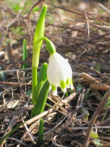

Erstes Zeichen von Frühling: ein Märzenbecher
#############################################
:date: 2011-03-10 22:19
:author: Lioman
:category: Allgemein
:tags: Bild, Blume, Frühling, Frühlingsknotenblume, Märzenbecher
:slug: erstes-zeichen-von-fruehling-ein-maerzenbecher
:status: published

Nach dem letzten Winterbild, soll hier gleich mal der Frühling
ausbrechen. Ein im Winter gesetzter Märzenbecher reckt sein Köpfchen und
sonnt sich in der ersten Frühlingssonne. Offiziell heißt die Blume
übrigens `Frühlingsknotenblume (*Leucojum
vernum)* <https://secure.wikimedia.org/wikipedia/de/wiki/M%C3%A4rzenbecher>`__
- wieder was gelernt.

|image0|

