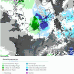

Ein Fundstück aus dem Garten
############################
:date: 2010-03-05 19:45
:author: Lioman
:category: Allgemein
:tags: Garantie, Garten, Heizkissen
:slug: fundstueck_aus_dem_garten
:status: published

***Hier habe ich mal wieder etwas aus der Kategorie kuriose
Fundstücke.***

Wir sind gerade dabei unseren Garten anzulegen und ein Beet zu richten.
Man glaubt gar nicht, was man aus so einem Stück Land rausholen kann. So
manches Fundstück hat schon seinen Weg zum Recyclinghof gefunden.Dieses
hier fand ich aber Kurios genug:

[caption id="attachment\_1434" align="alignright" width="150"
caption="Hinten"]\ |image0|\ [/caption]

[caption id="attachment\_1435" align="alignleft" width="150"
caption="Vorne"]\ |image1|\ [/caption]

| 

| 

| 

| 

| 

| 

| 

| 

Jetzt muss ich noch fieberhaft das dazu passende Gerät suchen,
wahrscheinlich kann ich es morgen gebrauchen, denn es kommt mal wieder
was auf uns zu:

|image2|\ *Quelle: Deutscher Wetterdienst*

