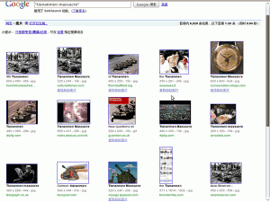

Google.cn ohne Zensur
#####################
:date: 2010-01-13 18:28
:author: Lioman
:category: Gesellschaft, Internet, Welt
:tags: China, Google, ROG, Suchmaschine, Zensur
:slug: google-cn-ohne-zensur
:status: published

***Das ist wohl die Nachricht des Tages im Netz: Die amerikanische
Suchmaschine*** `Google <http://de.wikipedia.org/wiki/Google%20Inc.>`__
***kündigt die Zusammenarbeit mit den Chinesischen Behörden auf und
zensiert sich nicht mehr selbst.***

Bisher waren sowohl Bild- wie Textsuchen nach Chinesischen
Menschenrechtsaktivisten, Bloggern und Dissidenten, "Systemfeinden",
sowie Informationen zu bestimmten Ereignissen unter chinesischen
Suchmaske zensiert. Google hat also wie viele andere westliche Firmen
(z.B. Bing, Yahoo) mit den Behörden kollaboriert, um am chinesischen
Markt mitzuverdienen.

Gestern Abend veröffentlichte Google die Nachricht auf dem eigenen
`Blog <http://googleblog.blogspot.com/2010/01/new-approach-to-china.html>`__.

Eine Bildersuche nach *`"tiananmen
massacre" <http://images.google.cn/images?hl=zh-CN&um=1&q=tiananmen+massacre&sa=N&start=0&ndsp=20>`__*
zeigt nun rollende Panzer, Demonstranten und Verletzte.

|image0|

Weitere Infos unter
`sueddeutsche.de <http://www.sueddeutsche.de/computer/730/500002/text/>`__
ROG

