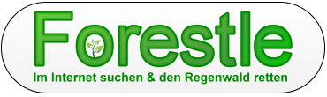

Grüne Suche
###########
:date: 2009-06-25 14:14
:author: Lioman
:category: Allgemein, Internet, Welt
:tags: CO2-neutral, Google, Google Alternative, Klimaschutz, Suchmaschine, Umweltschutz, Yahoo
:slug: gruene-suche
:status: published

Heute möchte ich mal wieder ein Projekt vorstellen. Diesmal ist es weder
Quelloffen noch frei, sondern Grün. Und zwar wirklich Grün und nicht nur
CO\ :sub:`2`-neutral. Wenn man auf die Seite
`www.forestle.org <http://www.forestle.org>`__\ geht wird man schon Grün
begrüßt: Eine klassische Suchmaske und ein kleiner Wald, der darüber
wächst.

|forestle| Die Idee des Projektes: Es wird wie bei den meisten
Suchmaschinen neben den Ergebnissen Werbung eingeblendet. Klickt man auf
diese verdient der Betreiber des Angebots normalerweise gut daran. 
Forestle nutzt die generierten Gelder jedoch nicht für sich. Nach Abzug
der Kosten für Verwaltung (ca. 10%) wird über das `"Adopt an Acre"
Programm <http://www.nature.org/joinanddonate/adoptanacre/>`__ Regenwald
gekauft.

Nach Angaben der Betreiber kann so pro Suche im Schnitt 0,1m² Regenwald
erstanden werden. Forestle dokumentiert dies auch in Monatlichen
`Berichten <http://forestle.org/_lang/de/about_forestle.php#proof>`__,
das sorgt für die nötige Transparenz und schafft Vertrauen. Die
Suchtreffer sind im Übrigen ganz gut, da hinter der Forestle-Suchmaske
`Yahoo <http://de.wikipedia.org/wiki/Yahoo>`__ das Netz durchforstet.
Will man Yahoo vermeiden kann man auch die Suchmaschine
`Znout <http://de.znout.org/>`__ nutzen. Diese sieht Forestle ziemlich
ähnlich hat aber Google zum Partner. Znout arbeitet
"nur"`CO\ :sub:`2`-neutral <http://www.co2stats.com/certpro.php?s=1187&ref=http://www.znout.org/>`__,
weitere Gewinne werden nicht in Umweltschutzprojekte investiert. Das ist
verwunderlich, da beide Seiten gleiche Adressen, Telefonnummern und
Verantwortliche angegeben haben.

*Nachtrag:*\ Auf Nachfrage wurde mir mitgeteilt, dass das an den
Restriktionen von Google liegt. Würde Znout auch Regenwald kaufen, würde
die Zusammenarbeit eingestellt.

*Nachtrag2:* Forestle ist eingestellt und wird auf
`Ecosia.org <http://ecosia.org>`__ umgeleitet. Am Prinzip ändert sich
nichts, wenn auch nun keine Angaben mehr über die geretteten
Quadratmeter pro Suche gemacht werden.

