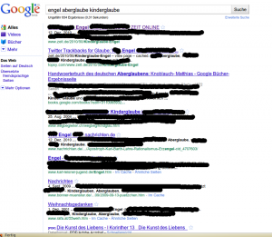

IGEL fährt Stacheln aus - gegen das Leistungsschutzrecht
########################################################
:date: 2010-12-13 15:44
:author: Lioman
:category: Gesellschaft, Internet
:tags: IGEL, Initiative, Internet, Leistungsschutzrecht, LSR, Politik, Urheberrecht, Verlage
:slug: igel-faehrt-stacheln-aus-gegen-das-leistungsschutzrecht
:status: published

|image0|\ IGEL - Initiative Gegen Ein Leistungsschutzrecht ist heute
gestartet und ging ans `Netz <http://leistungsschutzrecht.info/home>`__.
Man kann sich jetzt darüber streiten, ob solche Buchstabenspiele Sinn
machen, aber das Anliegen ist zu ernst. Verleger fordern zum
Urheberrecht des Erzeugers auch auch ein Leistungsschutzrecht des
Verlegers. Kommt das Leistungsschutzrecht so wie von Großverlagen
gefordert sind die Einschränkungen durch den JMSTV nur Pillepalle gegen
die Geißelungen durch den Leistungsschutz.

Um wirklich jedes Fitzelchen Text zu vergolden, sollen auch kleinste
Satzteile extra geschützt werden. Dieser Schuss geht hauptsächlich in
Richtung Suchmaschinen, denn diese nutzen Snippets, um die
Suchergebnisse darzustellen. Dem Urheberrecht nach gelten solche
Minimalfragmente des Zieltextes als gemeinfrei, da sie die Hürde der
Schöpfungshöhe nicht überschreiten.  Ohne diese Snippets sind
Suchmaschinen, wenn sie nicht zahlen wollen reine Linklisten und auch
kommentierte Links in Blogs sind nicht mehr möglich.

Ein Beispiel:

Möchte ich auf eine andere Seite verweisen tue ich das unter Umständen 
so:

Interessanter Artikel auf Zeit: `Was Engel sind - Kein Aberglaube
sondern ernster
Kinderglaube. <http://www.zeit.de/2010/50/Kinderglaube-Engel>`__

Mit aktivem Leistungsschutzrecht geht das nicht mehr - denn der Teaser
und sogar der Titel sind ja geschützt.

Interessanter Artikel auf Zeit: `Über
Engelglaube <http://www.zeit.de/2010/50/Kinderglaube-Engel>`__

Geht noch, man bekommt ja ungefähr mit, um was es geht. Habe ich aber
mehr als nur einen Artikel oder möchte eine Presseschau veröffentlichen
findet sich niemand mehr zurecht. Such ich bei Google nach "`engel
aberglaube
kinderglaube <https://encrypted.google.com/search?hl=de&biw=1280&bih=837&q=engel+aberglaube+kinderglaube&aq=f&aqi=&aql=&oq=&gs_rfai=>`__"
und Entferne alles was zu sehr Titel und Snippet ist habe ich folgendes
Bild (zum Vergrößern klicken):\ |image1|

Die Suche ist schlicht unbrauchbar - Google müsste also zahlen oder alle
Pressehäuser aus dem Index entfernen (Was mit Sicherheit durch
Kartellklagen juristisch beschossen würde). Ob Google nun zahlen
will/kann oder nicht. am Ende trifft es immer den Kunden, also der der
auf der anderen Seite des Bildschirms sitzt. Kleinere spezialisierte
Suchmaschinen hätten zum Beispiel keine Chance  und können gar nicht
erst in Konkurrenz mit Google&Co treten. Ich habe also weniger
Möglichkeiten in den weiten des Netzes die richtigen Inhalte zu finden.

Es gibt noch viele Argumente gegen diesen unsinnigen Plan. Vielleicht
werde ich hier noch ein paar vorbringen, doch vieles ist ausgiebig auf
der Seite von IGEL unter
`Argumente <http://leistungsschutzrecht.info/argumente>`__ aufgeführt.

Das LSR gilt es auf jeden Fall zu verhindern, denn verdienen tun nur die
großen Verlage.

.. |image0| image:: http://leistungsschutzrecht.info/_igel-banner/banner-igel-180x180px.png
   :class: alignright
   :width: 180px
   :height: 180px
   :target: http://leistungsschutzrecht.info/home

