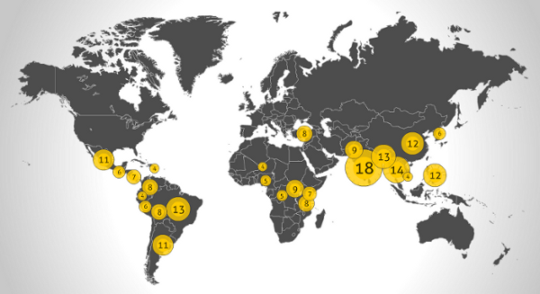

Interaktive Karte: Produkte aus Sklavenarbeit
#############################################
:date: 2011-09-10 19:38
:author: Lioman
:category: Welt
:tags: Sklaverei
:slug: interaktive-karte-produkte-aus-sklavenarbeit
:status: published

|image0|\ Die Website
`productsofslavery.org <http://productsofslavery.org/>`__ zeigt eine
interaktive Karte, die visualisiert wo welche Produkte in Kinder- oder
Zwangsarbeit hergestellt werden.

Die Karte wurde von `Anti
Slavery <http://www.antislavery.org/english/>`__ zusammengebaut und ist
erschreckend informativ. Gegen solche Produktionsmethoden hilft nur die
vielbeschriebene "Macht des Konsumenten". Beim Einkaufen darf eben nicht
nur auf den kleinsten Preis geachtet werden.

via
`Backhaus <http://www.sebastianbackhaus.de/2011/09/09/interaktive-weltkarte-zeigt-lander-mit-produkten-aus-sklavenarbeit/?utm_source=rss&utm_medium=rss&utm_campaign=interaktive-weltkarte-zeigt-lander-mit-produkten-aus-sklavenarbeit>`__

