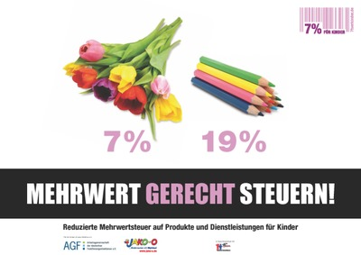

Kampagne für gerechtere Steuern: 7% auf Kinderartikel
#####################################################
:date: 2011-11-15 16:00
:author: Lioman
:category: Allgemein, Gesellschaft
:tags: 7%, Aktion, Familie, Familienpolitik, Kinder, Mehrwertsteuer, Politik
:slug: kampagne-fuer-gerechtere-steuern-7-auf-kinderartikel
:status: published

|image0|\ In Deutschland gibt es zwei Mehrwertsteuersätze. Den Regulären
(19%) und den Verminderten (7%).

Mit dem verminderten Steuersatz soll der erwerb von Grundnahrungsmitteln
wie z.B. Mehl begünstigt werden. Diese 7% zahlt man auch, wenn man
Kunstgegnstände oder Druckerzeugnisse erwirbt. Und seit 01.01.2010 muss
man auch bei Übernachtungen in Hotels weniger an den Staat abführen
(dafür mehr an den Hotelier). Diese Änderung ist eine große
Errungenschaft der FDP und auch das einzige was diese in der jetzigen
Regierung hinbekommen hat: Steuergeschenke an [STRIKEOUT:Beitragszahler]
ehrenwerte Spender.

Das ganze System ist ziemlich unübersichtlich und ungerecht. So zahlt
man für seinen Hamburger bei McDonalds immer gleich viel. Sagt man
jedoch *"Zum Mitnehmen"*  werden nur 7% an unseren Staat überwiesen,
denn es scheint ein Grundbedürfnis des Deutschen zu sein etwas mal
schnell unterwegs reinzuwürgen/kippen. Fängt man an zu recherchieren,
stößt man auf alle möglichen Kuriositäten und Ungereimtheiten. Bücher
werden wie anfangs  erwähnt, als Kulturgut,  mit 7% veranschlagt. Setzt
sich jedoch jemand ins Studio und presst besagtes Kulturgut auf CD muss
man im Laden 19% des Wertes an den Staat weiterreichen.

Ein
`Aktionsbündnis <http://www.7fuerkinder.de/home/initiatoren.html>`__ versucht
derzeit mit einer Kampagne für gerechtere Steuern zu werben. `7% für
Kinder <http://www.7fuerkinder.de/>`__ veranstaltet derzeit eine
`Unterschriftenaktion <http://www.7fuerkinder.de/home/unterschriften.html>`__ bei
der von der Politik eine Reduktion der Mehrwertsteuer auf alle Produkte
und Dienstleistungen für Kinder gefordert wird. Dies wäre vor allen
Dingen für junge Familien ein wirkliche Entlastung. Windeln,
Kindersitze, Kitaplätze usw.  könnten dann mit einem Schlag 12%
günstiger werden. Das wäre dann eine Steuererleichterung, die wirklich
denen zugute kommt, die es benötigen. Damit würde unsere Gesellschaft
ein Stück Familienfreundlicher.

