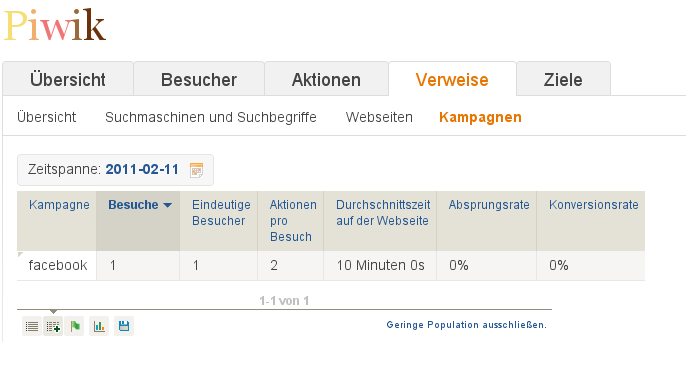

Mit Piwik Kampagnen tracken
###########################
:date: 2011-02-11 18:00
:author: Lioman
:category: Internet
:tags: Kampagne, Piwik, Statitik
:slug: mit-piwik-kampagnen-tracken
:status: published

Ich nutze hier im Blog als Statistiktool, die freie Alternative zu
Google Analytics, Piwik. Piwik beherrscht alles, was ein
Statistikprogramm können muss dazu werden immer schöne Grafiken
präsentiert und die Exportfunktionen sind auch umfassend.

Wenn man wissen möchte woher die Leser kommen kann man natürlich den
Referrer auslesen für eine genaue Analyse ist jedoch das erstellen von
Kampagnen sinnvoller.

Piwik unterstützt das von Hause aus möchte man den Namen des
URL-Teilstrings ändern muss man in der Datei *config.ini.php* im Ordner
*config* folgende Zeilen hinzufügen:

``[Tracker] campaign_var_name = utm_source campaign_keyword_var_name = utm_campaign``

So werden alle GA- Kampagnen getrackt - man kann jedoch jeden beliebigen
Namen eingeben wobei *campaign\_var\_name* den eigentlichen
Kampagnennamen bestimmt während *campaign\_keyword\_var\_name* ein
Stichwort hinzufügt. Nun muss man nur noch an alle Links das Stichwort
anhängen.

Beispiel: Alle Links die an Facebook gehen bekommen
*?utm\_source=facebook* angehängt klickt jemand darauf erkennt Piwik die
Kampagne und fügt sie hinzu, falls sie noch nicht existiert.

Die Ausgabe präsentiert dann allerlei Daten und Grafiken:

|image0|

