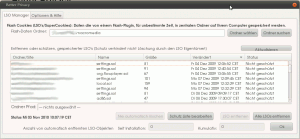

Schlimme, schlimme LSOs
#######################
:date: 2010-11-25 14:28
:author: Lioman
:category: Allgemein, Internet, PC und Technik
:tags: BetterPrivacy, Cookie, Datenschutz, DOM, Erweiterung, firefox, Flash, LSO, Privacy, Sicherheit, Super-Cookie
:slug: schlimme-schlimme-lsos
:status: published

LSO steht für `Local Shared
Objects <https://secure.wikimedia.org/wikipedia/de/wiki/Flash-Cookie>`__
und dies sind nichts anderes als Flash-Cookies (auch Super-Cookie
genannt), in denen Flashobjekte von beliebigen Websiten Informationen
ablegen. Manches ist ganz praktisch, da eine Videoseiten, dann alle
Videos immer in der gewünschten Qualitätsstufe zeigt, oder das kleine
Pausenflashspiel den Nutzernamen sich merken kann. Aber LSOs sind
gefährlich, sehr sogar viel schlimmer als die normalen
`HTTP-Cookies <https://secure.wikimedia.org/wikipedia/de/wiki/HTTP-Cookie>`__,
die man als aufmerksamer Internetsurfer immer mal wieder löscht.

Warum sind LSOs so gefährlich?
~~~~~~~~~~~~~~~~~~~~~~~~~~~~~~

-  LSOs haben eine unendliche Laufzeit
-  sie können bis zu 100kb Daten speichern
-  diese können Seitenaufrufe, Einstellungen, Betriebssystem,
   Nutzernamen enthalten
-  Flashobjekte sind manchmal "unsichtbar" dennoch können sie
   gespeicherte Inhalte senden
-  Man kann nicht 1 zu 1 sagen welcher Cookie welcher Trackingdomain
   gehört (erfordert genaue Analysen)
-  LSOs werden in gesonderten Ordnern gespeichert d.h.

   #. der Browser löscht sie nicht und
   #. egal welcher Browser genutzt wird die Daten landen immer in der
      gleichen Datei

-  Die Daten können aus einem LSO ausgelesen und in ein traditionelles
   (schon gelöschtes ) Cookie wieder eingeschrieben werden

Was das heißt zeigt ein Screenshot der bei mir gespeicherten LSOs. Dazu
muss man sagen, dass ich in der Zeit mein System + Plugin mehrfach auf
den neusten Stand gebracht habe und den PC gewechselt habe. Doch die
LSOs habe ich immer brav mitgenommen. |image0|

Über elf Monate - das finde ich ziemlich erschreckend, vor allen Dingen
wenn man bedenkt, was alles in 100kb passt: genau 99990 Zeichen!

Wie werde ich sie Los?
~~~~~~~~~~~~~~~~~~~~~~

Für den `Firefox <http://www.mozilla-europe.org/de/firefox/>`__
existiert eine exzellente (auf Deutsch dokumentiertes) Erweiterung :
`BetterPrivacy <https://addons.mozilla.org/de/firefox/addon/6623/>`__

Hat man diese Erweiterung installiert ermöglicht sie eine einfache
Löschung der Cookies.

Das Plugin ist ziemlich selbsterklärend, man kann die LSOs richtig
verwalten und z.B. bestimmte schützen oder alle automatisch beim beenden
des Browsers über die Klinge springen lassen. Diese Einstellungen
empfehle ich, denn der Mehrwert dieser Dateien ist sehr gering.

Außerdem kann man mit dieser Erweiterung gleich noch die
`DOM-Storage-Datei <https://secure.wikimedia.org/wikipedia/de/wiki/DOM_Storage>`__
(eine andere Art von Super-Cookie) loswerden, was die Sicherheit des
Browsers noch ein wenig erhöht.

Nutzt man andere Browser oder möchte nicht noch eine Erweiterung ist
auch eine manuelle Löschung des Ordners möglich.

Laut Wikipedia findet man die LSOs in folgenden Ordnern:

+--------------------------------------------------------------------------------------------+---------------------------------------------------------------------------------------+-------------------------------------------------------------+
| Betriebssystem                                                                             | Speicherort                                                                           | Anmerkung                                                   |
+============================================================================================+=======================================================================================+=============================================================+
| `Microsoft Windows <https://secure.wikimedia.org/wikipedia/de/wiki/Microsoft_Windows>`__   | %AppData%\\Macromedia\\Flash Player\\#SharedObjects                                   | \ *%AppData%* steht für das Benutzerverzeichnis             |
|                                                                                            | %APPDATA%\\Macromedia\\Flash Player\\macromedia.com\\support\\flashplayer\\sys        | Adobe-AIR-Anwendungen speichern separat in eigenen Ordner   |
|                                                                                            | %APPDATA%\\[AIR Paket ID]\\Local Store\\#SharedObjects\\                              |                                                             |
+--------------------------------------------------------------------------------------------+---------------------------------------------------------------------------------------+-------------------------------------------------------------+
| `Mac OS X <https://secure.wikimedia.org/wikipedia/de/wiki/Mac_OS_X>`__                     | ~/Library/Preferences/Macromedia/Flash Player/#SharedObjects                          | \ *~* steht für das Benutzerverzeichnis                     |
|                                                                                            | ~/Library/Preferences/[AIR Paket ID]                                                  | Adobe-AIR-Anwendungen speichern separat in eigenen Ordner   |
|                                                                                            | ~/Library/Preferences/Macromedia/FlashPlayer/macromedia.com/Support/flashplayer/sys   |                                                             |
+--------------------------------------------------------------------------------------------+---------------------------------------------------------------------------------------+-------------------------------------------------------------+
| `Linux <https://secure.wikimedia.org/wikipedia/de/wiki/Linux>`__                           | ~/.macromedia/Macromedia/Flash Player                                                 | \ *~* steht für das Benutzerverzeichnis                     |
|                                                                                            | ~/.macromedia/Flash\_Player/#SharedObjects                                            |                                                             |
+--------------------------------------------------------------------------------------------+---------------------------------------------------------------------------------------+-------------------------------------------------------------+

Table: Standard Speicherorte

