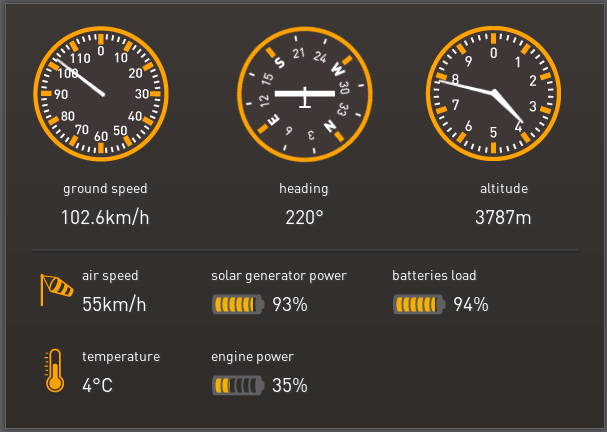

Solarflugzeug: Solar Impulse fliegt nach Marokko
################################################
:date: 2012-05-24 10:53
:author: Lioman
:category: Allgemein, PC und Technik, Welt
:tags: Flugzeug, Interkontinental, Live, Solar, Solar Impulse
:slug: solarflugzeug-solar-impulse-fliegt-nach-marokko
:status: published

Das Solarflugzeug Solar Impulse fliegt heute seit 6:24 GMT den ersten
Interkontinentalflug nach Marokko.Die Pioniere zeigen, was mit Solar-
und Akkutechnik inzwischen schon möglich ist.

Den ganzen Flug kann man über das Internet verfolgen. Hier wäre der
Livestream aus dem Kontrollzentrum:

|image0| Auf der Internetseite von Solar Impulse gibt es aber noch alle
möglichen anderen Daten zum Flug. So wird einem nicht nur die aktuelle
Temperatur, Ladestand der Batterien und Leistung der Solarzellen
angezeigt sondern auch die aktuelle Position.

