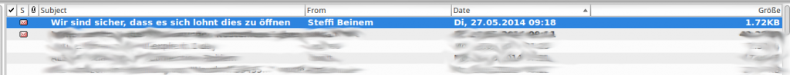

#SPAM - Es wird sich lohnen
###########################
:date: 2014-05-29 13:44
:author: Lioman
:category: Allgemein
:tags: E-Mail, Spam
:slug: spam-es-wird-sich-lohnen
:status: published

[caption id="attachment\_5506" align="aligncenter" width="620"]\ |Es
wird sich lohnen... Für wen?| Es wird sich lohnen... Für wen?[/caption]

Ja ich bin mir sicher, dass es sich lohnen wird. Allerdings in keinem
Fall für den Empfänger. Wenn ich so etwas bekomme frage ich mich immer:
Wer öffnet das? Und wer von denen die es überhaupt öffnen, lässt auch
noch Geld bei solchen "Anbietern".

Aber es scheint sich ja zu lohnen, sonst wäre dieser Geschäftszweig
schon längst ausgestorben.

