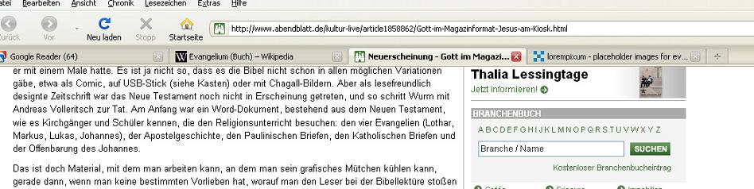

Stilblüte: Das heilige Evangelium nach Libero Matthäus
######################################################
:date: 2011-04-16 18:30
:author: Lioman
:category: Allgemein
:tags: Abendblatt, Evangelium, Lothar, religion, Stilblüte
:slug: stilbluete-das-heilige-evangelium-nach-libero-matthaeus
:status: published

Gerade habe ich bei
`BILDBlog <http://www.bildblog.de/29515/und-lukas-ist-podolski-ja/>`__\ eine
Stilblüte entdeckt, die einfach zu Gut ist, um sie nicht auch hier ins
Blog zu schieben. Das Hamburger Abendblatt
`berichtet <http://www.abendblatt.de/kultur-live/article1858862/Gott-im-Magazinformat-Jesus-am-Kiosk.html>`__\ über
zwei Journalisten, die das Neue Testament als Magazin herausbringen
wollen. Das hier ist so gut, dass ich mir jeden weiteren Kommentar mit
einem breiten Grinsen erspare:

|image0|

 

 

