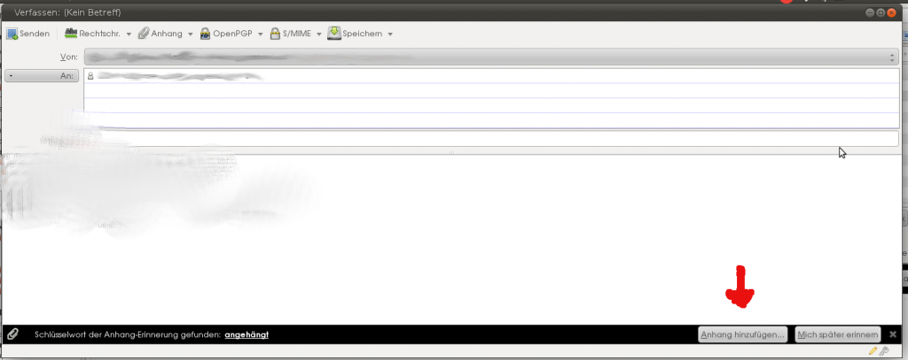

Thunderbird erinnert an Anhänge
###############################
:date: 2011-07-30 14:42
:author: Lioman
:category: Allgemein
:tags: Anhang, Erinnerung, Software, thunderbird
:slug: thunderbird-erinnert-an-anhaenge
:status: published

| Gerade entdeckt:
| |image0|

Hoffentlich hilfts! Habe schon so oft Mails ohne Anhang verschickt.

