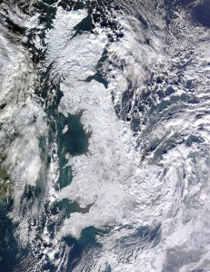

Weiße Welten
############
:date: 2010-01-09 13:06
:author: Lioman
:category: Welt
:tags: Bild, NASA, nasa satellite, satellite terra, Satellitenbild, Schnee, Vereinigtes Königreicg, Winter
:slug: weisse-welten
:status: published

Ich habe schon ein paar Artikel auf der Agenda, die ich schon seit
einiger Zeit posten wollte. Aber es gibt mal wieder alles mögliche, was
mich davon abhält. Doch ein Bild, über das ich bei
`scienceblogs <http://www.scienceblogs.de/diaxs-rake/2010/01/verschneites-konigreich.php>`__
gestolpert bin möchte ich doch schnell veröffentlichen, da es einfach
atemberaubend ist. Das ganze `Vereinigte
Königreich <http://de.wikipedia.org/wiki/Vereinigtes_Königreich>`__ weiß
- doch seht selbst *(klicke aufs Bild um zu vergrößern)*:
|image0|\ *Quelle: `Nasa Satellite
Terra <http://rapidfire.sci.gsfc.nasa.gov/gallery/?2010007-0107/GreatBritain.A2010007.1150.1km.jpg>`__*

